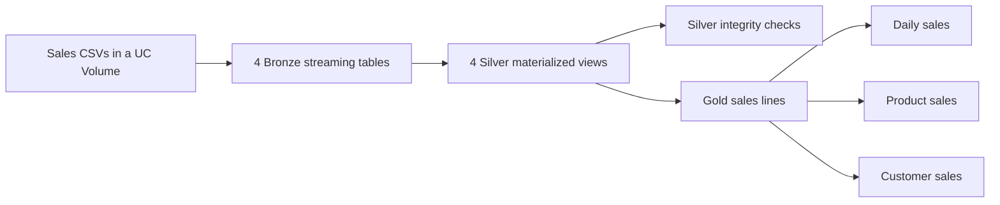

# Architecture

## Confirmed scope

- Platform: Databricks.
- Processing framework: Lakeflow Spark Declarative Pipelines.
- Architecture: Bronze → Silver → Gold.
- Approach: start from scratch and build the example step by step.
- Implementation language: SQL.
- Scenario: synthetic retail sales with customers, products, orders, and order lines.

## Layer responsibilities

| Layer | Responsibility | Output |
| --- | --- | --- |
| Bronze | Preserve source records with ingestion metadata | Raw datasets |
| Silver | Clean, type, validate, and deduplicate according to source semantics | Trusted datasets |
| Gold | Apply business logic and analytical modeling | Facts, dimensions, and aggregates as needed |

One triggered serverless pipeline owns all outputs in the `ldp_example` catalog across three schemas:

| Layer | Schema | Example dataset |
| --- | --- | --- |
| Bronze | `10_bronze` | `ldp_example.10_bronze.bronze_orders` |
| Silver | `20_silver` | `ldp_example.20_silver.silver_orders` |
| Gold | `30_gold` | `ldp_example.30_gold.gold_daily_sales` |

Catalog and schema names are bundle variables passed into the SQL through pipeline configuration. Every dataset definition and reference uses a fully qualified, quoted catalog/schema path. The pipeline default schema is `10_bronze`; explicit names route Silver and Gold to their own schemas. Source files live in a separately configured Unity Catalog Volume.

Bronze streaming tables ingest the four CSV entity directories with Auto Loader, retaining raw strings, rescued fields, file paths, and ingestion timestamps. Silver materialized views normalize strings, cast types, and remove identical normalized records across the full Bronze state. Silver retains `_rescued_data` solely to enforce schema quality; valid rows have a null value.

Row-level expectations fail on invalid typed values. `silver_integrity_checks` validates key uniqueness, foreign keys, complete orders, and customer creation dates. Conflicting keys do not implement updates or CDC; they fail the integrity flow. Gold enriches completed order lines and creates daily, product, and customer sales summaries. Transaction prices and decimal arithmetic determine revenue; each line is rounded before aggregation.

Lakeflow derives dependencies from the dataset queries. Integrity checks are a separate flow: a failed update is not a pipeline-wide transaction rollback. Consume results after the complete pipeline succeeds. See [run_pipeline.md](run_pipeline.md) for refresh behavior and validation.

## Decisions still open

- Source Volume location (`source_path` remains required).
- Workspace access and a real Databricks validation/run.
- Future lessons: intentional quality-error batches, CDC, and scheduling.

## Current implementation

SQL definitions, a development bundle, synthetic CSVs, and local logic tests are implemented. See [data_dictionary.md](data_dictionary.md) for the source contract. Databricks deployment and runtime behavior remain unverified.

The previous notebook-based Job example has been removed from the working tree.
